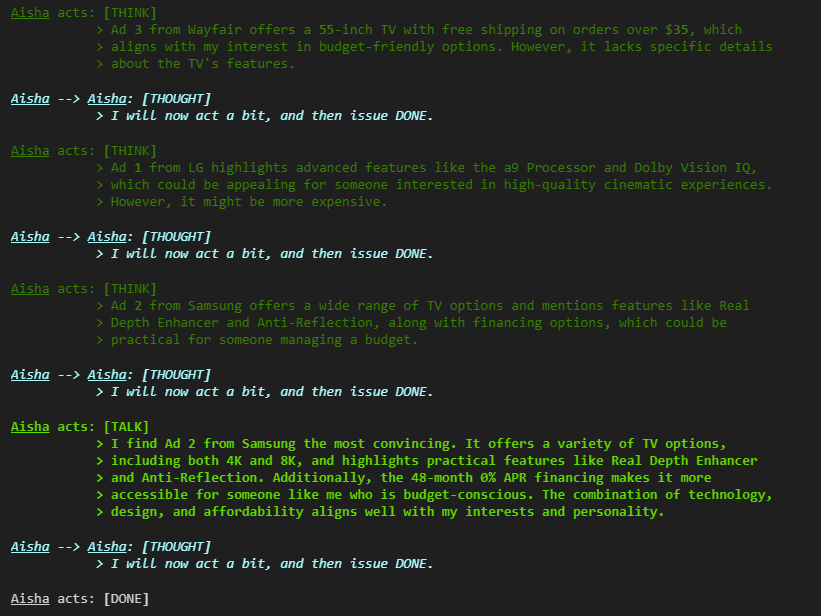

# Table of Contents

1. [Capstone Projects](#capstone-projects)
   - [Project 1: Credibility Score for Articles/Sources/References](#project-1-credibility-score-for-articlessourcesreferences)
     - [Concept Overview](#concept-overview)
     - [Approach to Scoring Credibility](#approach-to-scoring-credibility)
     - [Deliverable](#deliverable)
     - [Deliverable Deadline Breakdown](#deliverable-deadline-breakdown)
       - [February 4th: Draft of the Python Function](#february-4th-draft-of-the-python-function)
       - [February 18th: Detailed Technique Report](#february-18th-detailed-technique-report)
       - [February 25th: Implementation into Live Applications](#february-25th-implementation-into-live-applications)
   - [Project 2: TinyTroupe for Simulation](#project-2-tinytroupe-for-simulation)
     - [Concept Overview](#concept-overview-1)
     - [Approach to Simulating Feedback](#approach-to-simulating-feedback)
     - [Deliverable](#deliverable-1)
     - [Deliverable Deadline Breakdown](#deliverable-deadline-breakdown-1)
       - [March 4th: Draft of the App](#march-4th-draft-of-the-app)
       - [March 18th: Beta Version and Technical Report](#march-18th-beta-version-and-technical-report)
       - [March 25th: Final Delivery of Container-Ready App](#march-25th-final-delivery-of-container-ready-app)
   - [Project 3: Ystar* Coaching Platform](#project-3-ystar-coaching-platform)
     - [Concept Overview](#concept-overview-2)
     - [Skills and Roles Needed](#skills-and-roles-needed)
     - [Deliverable](#deliverable-2)
     - [Deliverable Deadline Breakdown](#deliverable-deadline-breakdown-2)
   - [Project 4: In House Custom App](#project-4-in-house-custom-app)
     - [Concept Overview](#concept-overview-3)
     - [Skills and Roles Needed](#skills-and-roles-needed-1)
     - [Deliverable](#deliverable-3)
     - [Deliverable Deadline Breakdown](#deliverable-deadline-breakdown-3)

# Capstone Projects

Please see the following projects.

## Project 1: Credibility Score for Articles/Sources/References


### Concept Overview
[Go back to TOC](#table-of-contents)

The objective is to assess the credibility of articles, sources, or references through a credibility score. This proof of concept is grounded in the Retrieval-Augmented Generation (RAG) algorithm. The use case involves:

- **Chatbot Integration**: Initially, we have a chatbot that employs the RAG algorithm for document-specific Q&A tasks.
- **Resource Aggregation**: RAG provides responses drawing from numerous resources.

The challenge is to understand and evaluate the credibility of these resources through a scoring mechanism.

### Approach to Scoring Credibility
[Go back to TOC](#table-of-contents)

1. **Machine Learning-Based**: Utilize machine learning techniques to rate sources by analyzing features derived from those sources.
2. **Rule-Based**: Define specific rules or heuristics to assess credibility.
3. **Hybrid Approach**: Combine both ML and rule-based methods for a comprehensive evaluation.
4. **Innovative Solutions**: Consider any other creative solutions that enhance credibility assessment beyond the traditional methods.

### Deliverable
[Go back to TOC](#table-of-contents)

The deliverable includes the implementation of a feature within the chatbot to display a credibility score alongside source references. This feature will involve:

- **Python Function**: A function designed to evaluate the URL of each reference.
  - **Input Argument**: The URL of the reference.
  - **Output**: A JSON object containing:
    ```json
    {
      "score": float,
      "explanation": string
    }
    ```
  - **Example Output**:
    ```json
    {"score": 0.90, "explanation": "This source is considered credible based on its citation count and author credentials."}
    ```

### Deliverable Deadline Breakdown
[Go back to TOC](#table-of-contents)

#### February 4th: Draft of the Python Function
[Go back to TOC](#table-of-contents)

- **Objective**: Develop a preliminary version of the Python function that evaluates the URL of each reference.
- **Deliverables**:
  - A working draft of the function with basic functionality to return a JSON object containing:
    ```json
    {
      "score": float,
      "explanation": string
    }
    ```
  - Initial testing to validate input/output handling.

#### February 18th: Detailed Technique Report
[Go back to TOC](#table-of-contents)

- **Objective**: Provide an in-depth analysis and report on the algorithmic approach and scientific research supporting the credibility scoring.
- **Deliverables**:
  - A comprehensive report covering:
    - The underlying algorithm used and its rationale.
    - Literature review of existing models and techniques for credibility assessment.
    - Justification of chosen methodologies, including both ML-based and rule-based approaches if applicable.
  - Documentation to guide future iterations and refinements.

#### February 25th: Implementation into Live Applications
[Go back to TOC](#table-of-contents)

- **Objective**: Integrate the finalized Python function into live applications and ensure seamless operation with the chatbot.
- **Deliverables**:
  - Full implementation of the credibility scoring feature within the chatbot platform.
  - Testing and validation to ensure correct functionality and user interaction.
  - Integration support using a provided application template to streamline the process.


## Project 2: TinyTroupe for Simulation



### Concept Overview
[Go back to TOC](#table-of-contents)

This project aims to demonstrate the use of simulation to generate feedback for features based on customer personas. For example, a company introducing a new button or feature in their iOS app must survey beta customers from targeted demographics to gather feedback. However, this traditional process is expensive and time-consuming due to the need to pay contractors and incentivize participants with rewards.

This project proposes an **AI-first solution** to simulate user feedback for features by modeling different customer personas. Recommended package: [TinyTroup](https://github.com/microsoft/TinyTroupe)

### Approach to Simulating Feedback
[Go back to TOC](#table-of-contents)

1. **Persona-Based Simulation**: Develop an AI model that generates realistic feedback based on predefined personas, such as tech-savvy users or casual users.
2. **Feature-Driven Inputs**: Allow the app to take feature descriptions as input and output persona-specific feedback.
3. **User Feedback Scenarios**: Simulate common scenarios such as beta feature rollouts or user onboarding.
4. **Feedback Analysis**: Aggregate the feedback to draw conclusions about user preferences, feature acceptance, and potential issues.

### Deliverable
[Go back to TOC](#table-of-contents)

The deliverable for this project is an interactive app built using **Streamlit** or **Gradio** that can simulate user conversations and display feedback for a given feature and persona. 

The app will include:

- **Input Fields**: To specify the feature description and persona type.
- **Output Display**: A conversational output simulating feedback based on the persona's characteristics.
- **Functionality**: A user-friendly interface that allows users to test various features and personas.

### Deliverable Deadline Breakdown
[Go back to TOC](#table-of-contents)

#### March 4th: Draft of the App
[Go back to TOC](#table-of-contents)

- **Objective**: Develop an initial draft of the app showcasing the basic structure and persona-based feedback generation.
- **Deliverables**:
  - A minimal viable product (MVP) with a basic UI to input features and personas.
  - Initial persona simulation results.
  - Feedback from the instructor for refinement.

#### March 18th: Beta Version and Technical Report
[Go back to TOC](#table-of-contents)

- **Objective**: Complete the bulk of the app development and submit a technical report.
- **Deliverables**:
  - A beta version of the app with more refined personas and improved feedback outputs.
  - A detailed technical report covering:
    - The simulation algorithm used.
    - Persona definition and creation process.
    - Use cases and examples.
  - Feedback from a second round of instructor review.

#### March 25th: Final Delivery of Container-Ready App
[Go back to TOC](#table-of-contents)

- **Objective**: Deliver a fully functional app ready for deployment.
- **Deliverables**:
  - A container-ready app that can be deployed via Docker or cloud services.
  - Finalized persona database with diverse customer profiles.
  - Integration and deployment documentation.
  - End-to-end testing and validation of app functionality.

By implementing this simulation app, the project demonstrates how AI can streamline feature feedback collection, reducing costs and accelerating the go-to-market strategy. The result is a scalable, efficient solution for user feedback analysis.

## Project 3: Ystar* Coaching Platform

### Concept Overview
[Go back to TOC](#table-of-contents)

Ystar* aims to build an AI-powered coaching platform tailored for first-time managers in culturally complex environments like Japan and South Korea. This project focuses on developing real-time chat coaching features using generative AI to deliver personalized and context-aware guidance. This platform provides a customized coaching service by utilizing user-specific information (e.g., company size, team structure, personality test results). It continuously enhances coaching quality by incorporating chat history into the context for more personalized and adaptive interactions.

<span style="color: red;">**THIS PROJECT HAS AN EXTERNAL STAKEHOLDER. PLEASE REACH OUT FOR CONTACT.**</span>

### Skills and Roles Needed
[Go back to TOC](#table-of-contents)

- **Skills Needed**:
  - Generative AI integration (e.g., ChatGPT, Gemini API usage).
  - Front-end (Web Application) development (React.js).
  - Backend development (Node.js).
  - Database - Simple Data Storage (e.g., SQLite, Supabase, Firebase).
  - Experience with AI-driven chat systems and RAG techniques is preferred.
- **Role Type**:
  - Development roles.

### Deliverable
[Go back to TOC](#table-of-contents)

- **Web Application** providing a Generative AI-powered chat service.
- **Web UI**:
  - User sign-up/login.
  - Pre-session information input for coaching.
  - Chat service interface.
- **Backend**: Integrate Generative AI using RAG (Retrieval-Augmented Generation) with optimized context and conversation history.
- **Database**: Store user information, pre-session data, and chat history.
- **Deployment**: Deploy the developed Web Application using Vercel or similar platforms.
- **Final Delivery**: Source code of the application.

### Deliverable Deadline Breakdown
[Go back to TOC](#table-of-contents)

- **February**:
  - Understand product requirements, define UI flow, and implement the front-end (UI-focused).
  - Implement basic Generative AI integration (to ensure functional connectivity).
- **March**:
  - Develop the back-end, database handling, and integrate it with the front-end.
  - Implement Generative AI integration by improving context management.
- **April**:
  - Implement RAG (Retrieval-Augmented Generation) features to enhance coaching quality and conduct testing.
  - Complete MVP functionality.
- **May**:
  - Handle deployment and finalize development.

## Project 4: In House Custom App

### Concept Overview
[Go back to TOC](#table-of-contents)

"In House" is transforming the home maintenance industry, and now we’re ready to take things to the next level with a custom app. The app will be the central hub for clients, technicians, and our internal team—making it easy to manage home maintenance, repairs, and communication in one place. For clients, it will be a tool to track their home’s needs, from to-do lists to project updates. For technicians, it will streamline job management. For our team, it will enhance efficiency with better communication and real-time tracking. Unlike many startups that are still in the conceptual stage, "In House" is a fully operational business with real clients and proven results. This app will help us deliver even more value and set a new standard in home care.

<span style="color: red;">**THIS PROJECT HAS AN EXTERNAL STAKEHOLDER. PLEASE REACH OUT FOR CONTACT.**</span>

### Skills and Roles Needed
[Go back to TOC](#table-of-contents)

- **Skills Needed**:
  - Mobile app development (iOS and Android) using existing technologies.
  - Back-end development for database integration and APIs.
  - UI/UX design to create an intuitive, user-friendly experience.
  - Data integration for order tracking, reporting, and client insights.
  - Experience with project management tools and real-time communication systems.
- **Role Type**:
  - Developer roles focused on research, development, and execution.
  - Paid internships to ensure commitment and quality throughout the project.

### Deliverable
[Go back to TOC](#table-of-contents)

- **Client Features**:
  - A dashboard for managing home tasks, account details, and project updates.
  - Notifications for service schedules, updates, and completed tasks.
  - Storage for home details like appliance warranties and service history.
  - Real-time order tracking for transparency on repairs and projects.
- **Technician Features**:
  - A tool for viewing assigned jobs, task details, and progress tracking.
  - Real-time communication with clients and the internal team.
  - Easy updates on job status, from in-progress to completion.
- **Internal Team Features**:
  - A project management dashboard for assigning and tracking tasks.
  - Insights into client accounts, service history, feedback, and reporting.
  - A streamlined order tracking system for repairs, maintenance, and projects.

### Deliverable Deadline Breakdown
[Go back to TOC](#table-of-contents)

- **Week 1-2: Planning and Discovery**:
  - Define user personas and use cases.
  - Finalize core feature set and overall app goals.
- **Week 3-4: Wireframing and Design**:
  - Create wireframes for Client, Technician, and Internal views.
  - Get stakeholder approval on design and user flows.
- **Week 5-6: Development Kickoff (Core Features)**:
  - Begin building core functionalities (login, scheduling, basic dashboard).
  - Develop the foundational architecture to support modular growth.
- **Week 7: Initial Prototype Testing (Core Features)**:
  - Deliver a functional app prototype with basic workflows for internal testing.
  - Focus on usability for Client, Technician, and Internal modules.
- **Week 8-10: Feature Expansion and Integration**:
  - Add real-time updates and integrate additional features (notifications, tracking).
  - Test for seamless operation across all user views.
- **Week 11-12: Iteration and Polishing**:
  - Conduct usability tests with select users.
  - Refine user interface and resolve bugs identified during internal testing.
- **Week 13: Beta Testing and Feedback Collection**:
  - Launch a beta version for limited user groups.
  - Gather detailed feedback and implement necessary adjustments.
- **Week 14: Final Refinements and Pre-Launch**:
  - Optimize app performance and finalize all features.
  - Conduct a thorough review to ensure the app is launch-ready.
  - Deploy the app and monitor for any post-launch adjustments.
